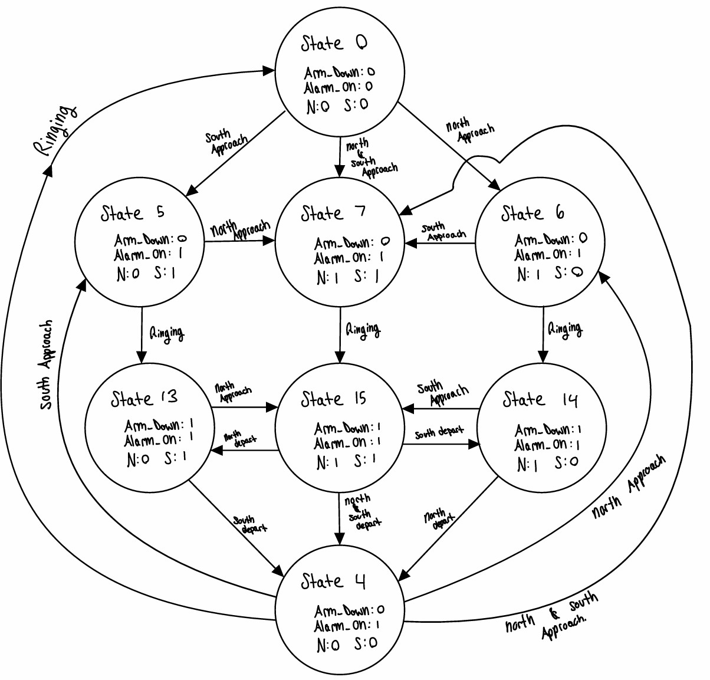

# Stein Witt & Burke Dambly Lab9

| number | arms_down | alarm_on | northbound_present | southbound_present | north_approach | south_approach | north_depart | south_depart | ringing | safety_hazard |
|--------|-----------|----------|--------------------|--------------------|----------------|----------------|--------------|--------------|---------|---------------|
| 0      | 0         | 0        | 0                  | 0                  | 6              | 5              | 21           | 21           | 19      |               |
| 1      | 0         | 0        | 0                  | 1                  | 7              | 20             | 21           | 0            | 19      | 22, 23        |
| 2      | 0         | 0        | 1                  | 0                  | 20             | 7              | 0            | 21           | 19      | 22, 23        |
| 3      | 0         | 0        | 1                  | 1                  | 20             | 20             | 1            | 2            | 19      | 22, 23        |
| 4      | 0         | 1        | 0                  | 0                  | 6              | 5              | 21           | 21           | 0       |               |
| 5      | 0         | 1        | 0                  | 1                  | 7              | 20             | 21           | 4            | 13      | 23            |
| 6      | 0         | 1        | 1                  | 0                  | 20             | 7              | 4            | 21           | 14      | 23            |
| 7      | 0         | 1        | 1                  | 1                  | 20             | 20             | 5            | 6            | 15      | 23            |
| 8      | 1         | 0        | 0                  | 0                  | 14             | 13             | 21           | 21           | 19      |               |
| 9      | 1         | 0        | 0                  | 1                  | 15             | 20             | 21           | 0            | 19      | 22            |
| 10     | 1         | 0        | 1                  | 0                  | 20             | 15             | 0            | 21           | 19      | 22            |
| 11     | 1         | 0        | 1                  | 1                  | 20             | 20             | 9            | 20           | 19      | 22            |
| 12     | 1         | 1        | 0                  | 0                  | 14             | 13             | 21           | 21           | 0       |               |
| 13     | 1         | 1        | 0                  | 1                  | 15             | 20             | 21           | 4            | 13      |               |
| 14     | 1         | 1        | 1                  | 0                  | 20             | 15             | 4            | 21           | 14      |               |
| 15     | 1         | 1        | 1                  | 1                  | 20             | 20             | 13           | 14           | 15      |               |

| number | invariant |
|--------|-----------|
| 17     |The power will never be interrupted|
| 18     |rains on each track only run in one direction.|
| 19     |Ringing must be happening for the time to elapse |
| 20     |An approach can only happen if a train is not already present|
| 21     |A depart can only happen if the train is present|
| 22     |If a train is present the alarm must be on|
| 23     |If a train is present the barrier must be down|

